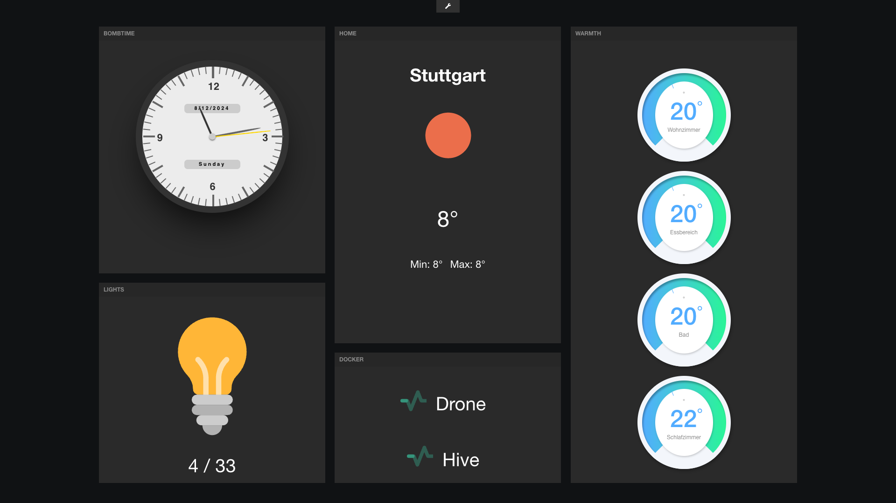

# freeboard

This Freeboard is a fork of [Jim Heisings damn-sexy dashboard app](https://github.com/Freeboard/freeboard) with super-powers:

- Persistant storage of dashboards in a **MongoDB**
- **GraphQL** API backend
- Distributable through **docker compose**
- Modern **Vue.js** v3 frontend
- Extendable **HTTP-Proxy** to bypass CORS
- **Monorepo** through `npm` workspaces
- **Commit-Hooks** with `pre-commit`
- **nunjucks** templating in widgets
- **CSS-Variables** for all colors



## Installation

```bash
git clone git@github.com:artificialhoney/freeboard.git
cd freeboard
git checkout dev
npm install
```

## Usage

### Docker-Compose

```bash
docker compose up -d
```

### Development

```bash
npm run dev
```

## TODO

- Secure environment variable store
- Template engine for widget rendering
- i18n: externalize strings and labels

## Copyright

Copyright © 2013 Jim Heising (https://github.com/jheising)
<br>
Copyright © 2013 Bug Labs, Inc. (https://buglabs.net)
<br>
Copyright © 2024 Sebastian Krüger (https://sk.honeymachine.io)
<br>
Licensed under the [**MIT** license](/LICENSE).
